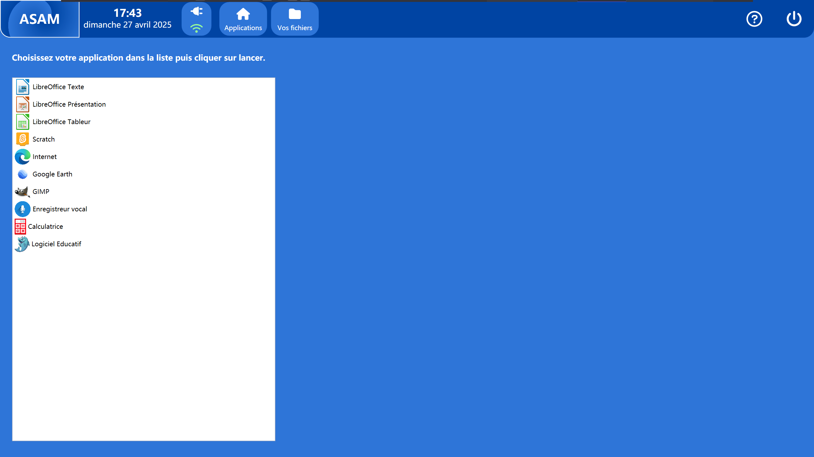

# ASAM
**ASAM** est un logiciel conçu pour faciliter la gestion d'un petit parc informatique dans des écoles.

ASAM vient :

- Aider les élèves tout en leur proposant une interface conviviale pour faciliter l'utilisation de l'appareil.

- Aider les enseignants, qui n'ont pas de temps à perdre avec la gestion de problèmes informatique

- Aider les administrateurs à venir corriger les problèmes facilement avec des logs détaillés et un programme fiable qui vient le guider durant la réparation en présentiel ou à distance de celui ci.

## ASAM Client

ASAM Client est la première composante d'ASAM, c'est la partie qui est installée sur les ordinateurs élèves

